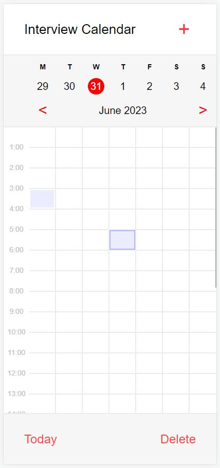
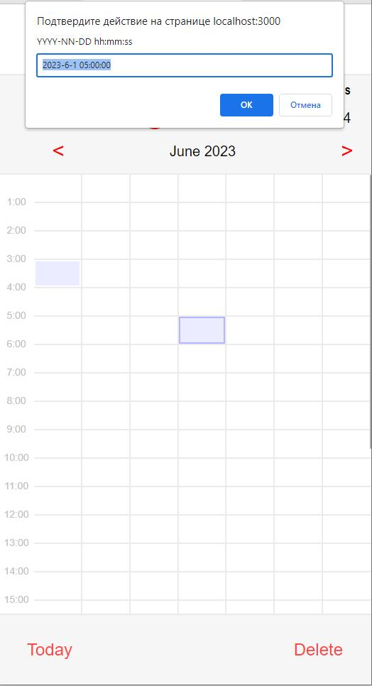

# Тестовое задание Calendar
# Тестовое задание на должность - Фронтенд разработчик React

Это приложение является тестовым заданием, позволяет составлять календарь событий

Работу приложения можно посмотреть по ссылке [calendar-test](https://voodo13.github.io/calendar-test-dist/)




## Стек:
- CRA
- React
- Styled-components


## Запуск приложения
Скачать zip архив с репозитория GitHub и распаковать, либо выполнить в консоли:
```
git clone https://github.com/Voodo13/calendar-test.git
cd green-api-test
```
Находясь внутри папки с проектом, установить зависимости
```
npm install
```

### Запуск проекта в режиме разработки
```
npm start
```
Далее перейти по ссылке [http://localhost:3000/](http://localhost:3000/)

### Сборка проекта
```
npm run build
```
Проект будет собран в ./dist


